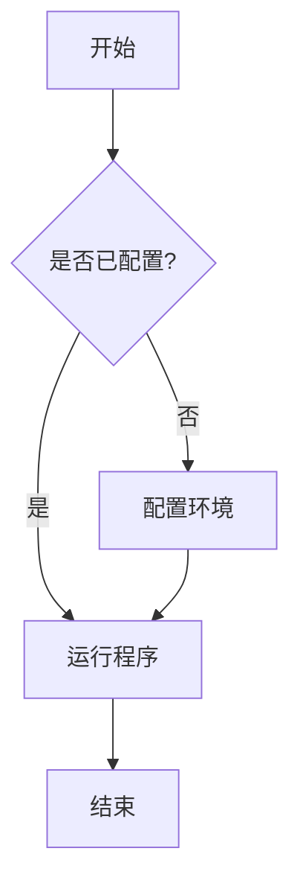
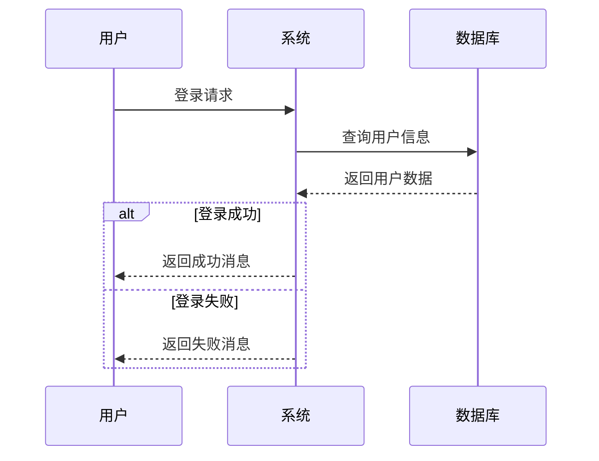
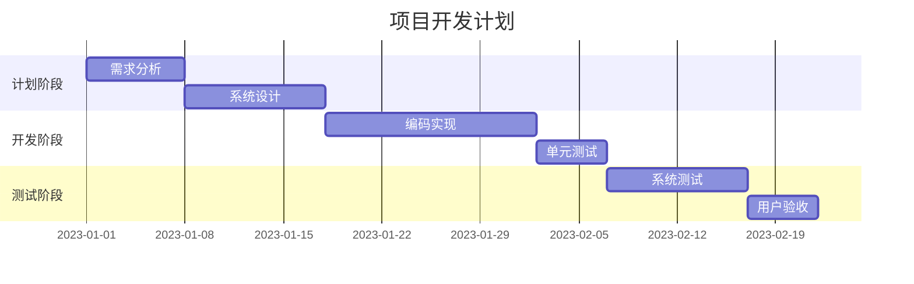
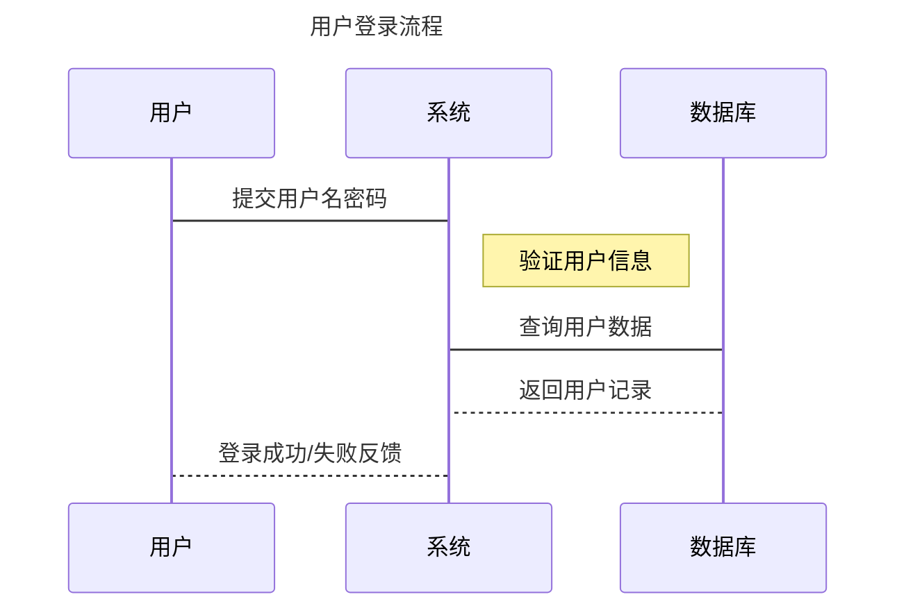
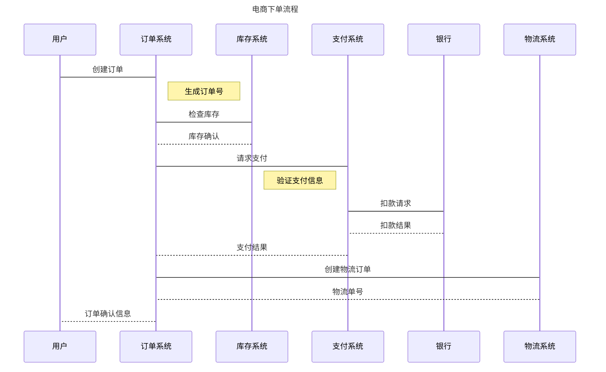
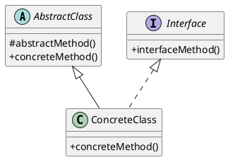
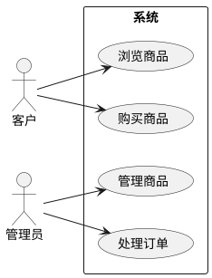
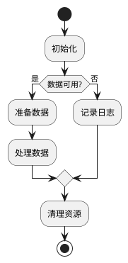

# Butterfly主题全面功能与样式指南

本文将全面展示Butterfly主题的各种功能、标签插件、高级样式与布局，帮助你创建更加美观、专业的博客内容。

> **注意**：本文中的示例需要正确安装并配置Butterfly主题才能正常显示。如果你看到原始标签而非渲染后的效果，请查看文末的安装说明。

## 1. Front-matter 配置

Butterfly 主题的 Front-matter 支持以下常用配置项：

| 写法 | 解释 |
| --- | --- |
| title |【必需】文章标题 |
| date |【必需】文章创建日期 |
| updated |【可选】文章更新日期 |
| tags |【可选】文章标签 |
| categories |【可选】文章分类 |
| keywords |【可选】文章关键词 |
| description |【可选】文章描述 |
| top_img |【可选】文章顶部图片 |
| cover |【可选】文章缩略图(如果没有设置top_img,文章页顶部将显示缩略图) |
| comments |【可选】显示文章评论模块(默认 true) |
| toc |【可选】显示文章TOC(默认为设置中toc的enable配置) |
| toc_number |【可选】显示toc_number(默认为设置中toc的number配置) |
| auto_open |【可选】是否自动打开TOC(默认为设置中toc的auto_open配置) |
| copyright |【可选】显示文章版权模块(默认为设置中post_copyright的enable配置) |
| sticky |【可选】文章置顶排序 |
| mathjax |【可选】显示mathjax(当设置mathjax的per_page: false时，才需要配置，默认 false) |

## 2. 文本样式标签

### 2.1 基础文本标签

#### 行内标签








#### 小徽章

这是  一个内嵌表情的文本。

### 2.2 引用样式

#### 普通引用

> 这是一个普通的引用
> 这是引用的第二行

#### 带作者和出处的引用


凡事总须研究，才会明白。



NEW: DevDocs now comes with syntax highlighting. http://devdocs.io


## 3. 提示样式

### 3.1 简单提示框


默认提示框



default 提示框



primary 提示框



success 提示框



info 提示框



warning 提示框



danger 提示框


### 3.2 带图标的提示框


默认 提示块标签



primary 提示块标签



success 提示块标签



info 提示块标签



warning 提示块标签



danger 提示块标签


### 3.3 带标题的提示框


带标题和图标的警告提示块


## 4. 折叠面板

### 4.1 基本折叠面板


这是被隐藏的内容，点击标题可以展开或折叠。

可以在这里放置任何内容，比如代码、图片或文本。


### 4.2 默认展开的折叠面板


这个面板默认是展开的状态。

用户可以点击标题来折叠内容。


### 4.3 带代码的折叠面板


1. 进入hexo根目录，执行命令：

```bash
npm install hexo-theme-butterfly
```

2. 修改Hexo配置文件`_config.yml`：

```yaml
theme: butterfly
```



## 5. 选项卡

### 5.1 基本选项卡


<!-- tab 标签1 -->
这是第一个标签的内容
<!-- endtab -->

<!-- tab 标签2 -->
这是第二个标签的内容
<!-- endtab -->

<!-- tab 标签3 -->
这是第三个标签的内容
<!-- endtab -->


### 5.2 带图标的选项卡


<!-- tab 文本内容 @fas fa-file-alt -->
这是文本内容标签
<!-- endtab -->

<!-- tab 图片内容 @fas fa-image -->
这是图片内容标签


<!-- endtab -->

<!-- tab 视频内容 @fas fa-video -->
这是视频内容标签

<div style="position: relative; width: 100%; height: 0; padding-bottom: 56.25%;">
  <iframe style="position: absolute; width: 100%; height: 100%;" src="https://www.youtube.com/embed/dQw4w9WgXcQ" frameborder="0" allow="accelerometer; autoplay; clipboard-write; encrypted-media; gyroscope; picture-in-picture" allowfullscreen></iframe>
</div>
<!-- endtab -->

<!-- tab 视频内容 @fas fa-video -->
{% iframe https://player.bilibili.com/player.html?aid=55552239&bvid=BV1x4411V75U&cid=97049296&page=1 100% 500px %}
<!-- endtab -->


### 5.3 预选标签


<!-- tab 标签1 -->
内容1
<!-- endtab -->

<!-- tab 标签2 -->
内容2（这个标签会被默认选中）
<!-- endtab -->

<!-- tab 标签3 -->
内容3
<!-- endtab -->


### 5.4 代码分组选项卡


<!-- tab JavaScript -->

```javascript
function sayHello() {
  return "Hello, Butterfly!";
}
```

<!-- endtab -->

<!-- tab Python -->

```python
def say_hello():
    return "Hello, Butterfly!"
```

<!-- endtab -->

<!-- tab CSS -->

```css
.butterfly {
  color: #6f42c1;
  font-weight: bold;
}
```

<!-- endtab -->


## 6. 代码块和语法高亮

### 6.1 普通代码块

```javascript
function greet(name) {
  console.log(`Hello, ${name}!`);
  return `Welcome, ${name}`;
}
greet('Butterfly');
```

### 6.2 指定行高亮的代码块

```javascript line-numbers=true highlight=[2,4]
function greet(name) {
  console.log(`Hello, ${name}!`); // 这行会高亮
  const message = `Welcome, ${name}`;
  return message; // 这行会高亮
}
greet('Butterfly');
```

## 7. Obsidian风格Markdown增强

Butterfly主题可以通过集成一些markdown-it插件来支持Obsidian风格的Markdown语法，让你的博客内容更丰富多彩。

### 7.1 插件安装与配置

首先需要安装以下插件：

```bash
npm install markdown-it-obsidian-imgsize --save
npm install markdown-it-task-lists --save
npm install mdit-plugin-callouts --save
```

然后在Hexo的`_config.yml`文件中添加配置：

```yaml
markdown:
  plugins:
    - markdown-it-obsidian-imgsize
    - markdown-it-task-lists
    - mdit-plugin-callouts
```

### 7.2 Obsidian风格图片尺寸设置

使用`markdown-it-obsidian-imgsize`插件可以按照Obsidian的语法为图片指定尺寸。

**基本语法**：

```markdown


```

**示例**：

```markdown


```

**效果**：


### 7.3 增强的任务列表

使用`markdown-it-task-lists`插件可以创建更加美观的任务列表。

**基本语法**：

```markdown
- [ ] 未完成的任务
- [x] 已完成的任务
```

**示例**：

```markdown
### 我的待办事项

- [ ] 学习Hexo博客搭建
- [x] 安装Butterfly主题
- [ ] 配置主题外观
- [x] 学习Markdown语法
- [ ] 写一篇博客文章
```

**效果**：

### 我的待办事项

- [ ] 学习Hexo博客搭建
- [x] 安装Butterfly主题
- [ ] 配置主题外观
- [x] 学习Markdown语法
- [ ] 写一篇博客文章

### 7.4 Obsidian风格标注框

使用`mdit-plugin-callouts`插件可以创建Obsidian风格的标注框，为文档添加醒目的提示、警告和其他类型的信息框。

**基本语法**：

```markdown
> [!NOTE] 标题（可选）
> 这是一个标注内容。
```

**支持的标注类型**：

- NOTE（笔记）
- ABSTRACT、SUMMARY、TLDR（摘要）
- INFO、TODO（信息）
- TIP、HINT、IMPORTANT（提示）
- SUCCESS、CHECK、DONE（成功）
- QUESTION、HELP、FAQ（问题）
- WARNING、CAUTION、ATTENTION（警告）
- FAILURE、FAIL、MISSING（失败）
- DANGER、ERROR（危险）
- BUG（错误）
- EXAMPLE（示例）
- QUOTE、CITE（引用）

**示例**：

```markdown
> [!NOTE] 笔记
> 这是一个普通的笔记标注。

> [!TIP] 提示
> 这是一个提示信息，包含一些有用的技巧。

> [!WARNING] 警告
> 这是一个警告信息，提醒用户注意潜在问题。

> [!DANGER] 危险
> 这是一个危险提示，表示可能导致严重后果的操作。

```

**效果**：

> [!NOTE] 笔记
> 这是一个普通的笔记标注。

> [!TIP] 提示
> 这是一个提示信息，包含一些有用的技巧。

> [!WARNING] 警告
> 这是一个警告信息，提醒用户注意潜在问题。

> [!DANGER] 危险
> 这是一个危险提示，表示可能导致严重后果的操作。

> [!EXAMPLE] 代码示例
>
> ```javascript
> function hello() {
>   console.log('Hello, Callouts!');
> }
> ```

### 7.5 折叠标注

还可以创建可折叠的标注框：

```markdown
> [!FAQ]- 常见问题（点击展开）
> 这是一个折叠的标注框。
>
> 可以包含多个段落和其他内容。
```

**效果**：

> [!FAQ]- 常见问题（点击展开）
> 这是一个折叠的标注框。
>
> 可以包含多个段落和其他内容。

### 7.6 组合使用示例

这些插件可以相互组合使用，创建更丰富的内容：

```markdown
> [!TIP] 任务进度跟踪
>
> 当前项目状态：
> - [x] 需求分析
> - [x] 页面设计
> - [ ] 前端开发
> - [ ] 后端开发
> - [ ] 测试与部署
>
> 
```

**效果**：

> [!TIP] 任务进度跟踪
>
> 当前项目状态：
> - [x] 需求分析
> - [x] 页面设计
> - [ ] 前端开发
> - [ ] 后端开发
> - [ ] 测试与部署
>
> 

### 7.7 自定义样式

可以通过添加自定义CSS来调整这些插件的显示样式：

```css
/* 任务列表样式 */
.task-list-item {
  list-style-type: none;
  margin-left: -2em;
}

.task-list-item input {
  margin-right: 0.5em;
}

/* 标注框样式 */
.callout {
  border-radius: 5px;
  margin: 1em 0;
  padding: 1em;
  border-left-width: 4px;
  border-left-style: solid;
}

.callout-title {
  font-weight: bold;
  margin-bottom: 0.5em;
}

/* 为不同类型的标注框设置不同颜色 */
.callout-note {
  background-color: #f8f9fa;
  border-left-color: #4a8cca;
}

.callout-tip {
  background-color: #f3f9f4;
  border-left-color: #42b983;
}

.callout-warning {
  background-color: #fdf9e8;
  border-left-color: #e7c000;
}

.callout-danger {
  background-color: #fdf0f0;
  border-left-color: #dc3545;
}
```

## 8. 按钮样式

### 8.1 基本按钮



### 8.2 不同颜色的按钮









### 8.3 按钮大小和样式

默认按钮：


更大的按钮：


轮廓按钮：


## 9. 图片展示

### 9.1 普通图片


### 9.2 图库展示






### 9.3 指定列数的图库






## 10. 时间轴

### 10.1 单一年份时间轴


<!-- timeline 01-15 -->
Butterfly主题发布新版本
<!-- endtimeline -->
<!-- timeline 03-20 -->
主题功能更新与Bug修复
<!-- endtimeline -->
<!-- timeline 06-30 -->
发布主题使用文档
<!-- endtimeline -->


### 10.2 多年份时间轴


<!-- timeline 2021 -->
<!-- timeline 12月31日 -->
项目启动
<!-- endtimeline -->
<!-- endtimeline -->

<!-- timeline 2022 -->
<!-- timeline 06月15日 -->
完成基础功能开发
<!-- endtimeline -->
<!-- timeline 09月20日 -->
发布测试版本
<!-- endtimeline -->
<!-- endtimeline -->

<!-- timeline 2023 -->
<!-- timeline 01月01日 -->
正式版发布
<!-- endtimeline -->
<!-- timeline 07月15日 -->
用户数量达到10,000
<!-- endtimeline -->
<!-- endtimeline -->


## 11. 数学公式

当你需要使用数学公式时，可以开启 `mathjax: true`

行内公式:

$$
E=mc^2
$$

独立公式:

$$
\begin{align}
\frac{1}{1+e^{-x}}
\end{align}
$$

更复杂的公式:

$$
\begin{align}
\nabla \times \vec{E} &= -\frac{\partial \vec{B}}{\partial t} \\
\nabla \times \vec{B} &= \mu_0 \vec{J} + \mu_0 \varepsilon_0 \frac{\partial \vec{E}}{\partial t} \\
\nabla \cdot \vec{E} &= \frac{\rho}{\varepsilon_0} \\
\nabla \cdot \vec{B} &= 0
\end{align}
$$

## 12. 高级布局

### 12.1 分栏布局

使用div和flex创建分栏布局：

<div style="display: flex; gap: 20px; flex-wrap: wrap;">
  <div style="flex: 1; min-width: 250px;">
    <h4>第一栏</h4>
    <p>这是第一栏的内容，可以放置文本、图片等元素。</p>
    
  </div>
  <div style="flex: 1; min-width: 250px;">
    <h4>第二栏</h4>
    <p>这是第二栏的内容，当屏幕宽度不足时会自动换行。</p>
    
    可以在栏目中使用Butterfly的各种标签。
    
  </div>
  <div style="flex: 1; min-width: 250px;">
    <h4>第三栏</h4>
    <p>这是第三栏的内容，实现响应式的多栏布局。</p>
    
  </div>
</div>

### 12.2 卡片布局

创建卡片式布局：

<div style="display: flex; gap: 20px; flex-wrap: wrap; margin-bottom: 30px;">
  <div style="flex: 1; min-width: 300px; background-color: #f8f9fa; border-radius: 12px; padding: 20px; box-shadow: 0 4px 8px rgba(0,0,0,0.1);">
    <h4>功能卡片</h4>
    <p>这是一个简洁的功能卡片，可以用来展示特定内容。</p>
    <div style="text-align: right;">
      
    </div>
  </div>

  <div style="flex: 1; min-width: 300px; background-color: #f8f9fa; border-radius: 12px; padding: 20px; box-shadow: 0 4px 8px rgba(0,0,0,0.1);">
    <h4>资源卡片</h4>
    <p>这是一个展示资源的卡片，可以包含下载链接或其他资源信息。</p>
    <div style="text-align: right;">
      
    </div>
  </div>
</div>

## 13. 表格样式

### 13.1 基本表格

| 名称 | 类型 | 描述 |
|------|------|------|
| name | string | 用户名称 |
| age | number | 用户年龄 |
| email | string | 电子邮箱地址 |
| isActive | boolean | 是否激活状态 |

### 13.2 自定义表格样式

<table style="width: 100%; border-collapse: collapse; margin-bottom: 20px;">
  <thead>
    <tr style="background-color: #6f42c1; color: white;">
      <th style="padding: 12px; text-align: left; border: 1px solid #dee2e6;">产品</th>
      <th style="padding: 12px; text-align: left; border: 1px solid #dee2e6;">价格</th>
      <th style="padding: 12px; text-align: left; border: 1px solid #dee2e6;">状态</th>
    </tr>
  </thead>
  <tbody>
    <tr style="background-color: #f8f9fa;">
      <td style="padding: 12px; text-align: left; border: 1px solid #dee2e6;">产品A</td>
      <td style="padding: 12px; text-align: left; border: 1px solid #dee2e6;">¥199</td>
      <td style="padding: 12px; text-align: left; border: 1px solid #dee2e6;"><span style="color: #28a745;">✓ 有货</span></td>
    </tr>
    <tr>
      <td style="padding: 12px; text-align: left; border: 1px solid #dee2e6;">产品B</td>
      <td style="padding: 12px; text-align: left; border: 1px solid #dee2e6;">¥299</td>
      <td style="padding: 12px; text-align: left; border: 1px solid #dee2e6;"><span style="color: #dc3545;">✗ 缺货</span></td>
    </tr>
    <tr style="background-color: #f8f9fa;">
      <td style="padding: 12px; text-align: left; border: 1px solid #dee2e6;">产品C</td>
      <td style="padding: 12px; text-align: left; border: 1px solid #dee2e6;">¥399</td>
      <td style="padding: 12px; text-align: left; border: 1px solid #dee2e6;"><span style="color: #ffc107;">! 预订</span></td>
    </tr>
  </tbody>
</table>

## 14. 创意元素

### 14.1 进度条

使用CSS和HTML创建进度条：

<div style="margin-bottom: 20px;">
  <p>HTML/CSS: 90%</p>
  <div style="background-color: #e9ecef; height: 10px; border-radius: 5px;">
    <div style="background-color: #007bff; height: 100%; width: 90%; border-radius: 5px;"></div>
  </div>
</div>

<div style="margin-bottom: 20px;">
  <p>JavaScript: 75%</p>
  <div style="background-color: #e9ecef; height: 10px; border-radius: 5px;">
    <div style="background-color: #28a745; height: 100%; width: 75%; border-radius: 5px;"></div>
  </div>
</div>

<div style="margin-bottom: 20px;">
  <p>Node.js: 60%</p>
  <div style="background-color: #e9ecef; height: 10px; border-radius: 5px;">
    <div style="background-color: #6f42c1; height: 100%; width: 60%; border-radius: 5px;"></div>
  </div>
</div>

### 14.2 自定义提示气泡

使用CSS创建提示气泡效果：

<div style="position: relative; display: inline-block; margin-right: 20px;">
  <span style="display: inline-block; padding: 5px 12px; background-color: #007bff; color: white; border-radius: 4px; cursor: pointer;">
    鼠标悬停查看信息
  </span>
  <div style="position: absolute; left: 50%; transform: translateX(-50%); bottom: 100%; width: 200px; margin-bottom: 10px; padding: 10px; background-color: #343a40; color: white; border-radius: 6px; visibility: hidden; opacity: 0; transition: .3s; z-index: 10;">
    这是一个提示气泡，可以用来显示更多信息。
    <div style="position: absolute; left: 50%; margin-left: -5px; top: 100%; width: 0; height: 0; border-left: 5px solid transparent; border-right: 5px solid transparent; border-top: 5px solid #343a40;"></div>
  </div>
</div>

<style>
  div[style*="position: relative; display: inline-block"]:hover div[style*="position: absolute"] {
    visibility: visible;
    opacity: 1;
  }
</style>

## 15. 高级组合示例

### 15.1 博客信息卡片

<div style="background-color: #f8f9fa; border-radius: 15px; padding: 25px; margin-bottom: 30px; box-shadow: 0 5px 15px rgba(0,0,0,0.05);">
  <div style="display: flex; flex-wrap: wrap; gap: 20px; align-items: center;">
    <div style="flex: 0 0 100px;">
      
    </div>
    <div style="flex: 1; min-width: 200px;">
      <h3 style="margin-top: 0; margin-bottom: 10px; color: #343a40;">Butterfly 主题</h3>
      <p style="margin-bottom: 10px; color: #6c757d; font-size: 0.9em;">一个简洁、美观、功能丰富的 Hexo 主题</p>
      <div style="display: flex; gap: 10px;">
        
        
        
      </div>
    </div>
  </div>
</div>

### 15.2 特性展示卡片组

<div style="display: grid; grid-template-columns: repeat(auto-fill, minmax(250px, 1fr)); gap: 20px; margin-bottom: 30px;">
  <div style="background-color: #f8f9fa; border-radius: 10px; padding: 20px; box-shadow: 0 3px 8px rgba(0,0,0,0.05);">
    <div style="text-align: center; margin-bottom: 15px; color: #6f42c1;">
      <i class="fas fa-paint-brush" style="font-size: 2em;"></i>
    </div>
    <h4 style="text-align: center; margin-bottom: 10px;">美观设计</h4>
    <p style="text-align: center; color: #6c757d; font-size: 0.9em;">简洁卡片式设计，呈现优雅的视觉体验</p>
  </div>

  <div style="background-color: #f8f9fa; border-radius: 10px; padding: 20px; box-shadow: 0 3px 8px rgba(0,0,0,0.05);">
    <div style="text-align: center; margin-bottom: 15px; color: #6f42c1;">
      <i class="fas fa-bolt" style="font-size: 2em;"></i>
    </div>
    <h4 style="text-align: center; margin-bottom: 10px;">快速响应</h4>
    <p style="text-align: center; color: #6c757d; font-size: 0.9em;">响应式设计，在各种设备上都能完美展示</p>
  </div>

  <div style="background-color: #f8f9fa; border-radius: 10px; padding: 20px; box-shadow: 0 3px 8px rgba(0,0,0,0.05);">
    <div style="text-align: center; margin-bottom: 15px; color: #6f42c1;">
      <i class="fas fa-cogs" style="font-size: 2em;"></i>
    </div>
    <h4 style="text-align: center; margin-bottom: 10px;">丰富功能</h4>
    <p style="text-align: center; color: #6c757d; font-size: 0.9em;">提供多种标签插件和丰富的自定义配置选项</p>
  </div>

  <div style="background-color: #f8f9fa; border-radius: 10px; padding: 20px; box-shadow: 0 3px 8px rgba(0,0,0,0.05);">
    <div style="text-align: center; margin-bottom: 15px; color: #6f42c1;">
      <i class="fas fa-search" style="font-size: 2em;"></i>
    </div>
    <h4 style="text-align: center; margin-bottom: 10px;">SEO友好</h4>
    <p style="text-align: center; color: #6c757d; font-size: 0.9em;">优化的结构和元标签，有利于搜索引擎收录</p>
  </div>
</div>

## 16. 多媒体内容展示

Butterfly主题支持多种多媒体元素的展示，让你的博客内容更加丰富多彩。

### 16.1 音频展示

#### 简单HTML5音频播放器

使用HTML5音频标签：

<audio controls>
  <source src="https://interactive-examples.mdn.mozilla.net/media/cc0-audio/t-rex-roar.mp3" type="audio/mpeg">
  您的浏览器不支持音频标签。
</audio>

#### APlayer播放器

使用APlayer可以创建更美观的音频播放器：

<div id="aplayer"></div>
<link rel="stylesheet" href="https://cdn.jsdelivr.net/npm/aplayer/dist/APlayer.min.css">
<script src="https://cdn.jsdelivr.net/npm/aplayer/dist/APlayer.min.js"></script>
<script>
  const ap = new APlayer({
    container: document.getElementById('aplayer'),
    audio: [{
      name: '示例音乐',
      artist: '未知艺术家',
      url: 'https://interactive-examples.mdn.mozilla.net/media/cc0-audio/t-rex-roar.mp3',
      cover: 'https://source.unsplash.com/random/300x300/?music'
    }]
  });
</script>

#### 使用Butterfly内置标签

当配置了`aplayer: true`后，还可以使用以下方式嵌入音乐：

```markdown

```



### 16.2 视频展示

#### YouTube视频嵌入

使用iframe标签嵌入YouTube视频：

{% iframe https://www.youtube.com/embed/dQw4w9WgXcQ 100% 500px %}

#### 哔哩哔哩视频嵌入

同样可以嵌入B站视频：

{% iframe https://player.bilibili.com/player.html?aid=55552239&bvid=BV1x4411V75U&cid=97049296&page=1 100% 500px %}

### 16.3 地图嵌入

使用iframe嵌入Google地图：

{% iframe https://www.google.com/maps/embed?pb=!1m18!1m12!1m3!1d3022.9663095343008!2d-74.00425878428698!3d40.74076684379132!2m3!1f0!2f0!3f0!3m2!1i1024!2i768!4f13.1!3m3!1m2!1s0x89c259bf5c1654f3%3A0xc80f9cfce5383d5d!2sEmpire%20State%20Building!5e0!3m2!1sen!2sus!4v1588896001486!5m2!1sen!2sus 100% 450px %}

### 16.4 SVG图像

SVG图像非常适合展示矢量图形和图表：

<svg width="200" height="200" viewBox="0 0 200 200" xmlns="http://www.w3.org/2000/svg">
  <circle cx="100" cy="100" r="80" fill="#6f42c1" opacity="0.8" />
  <circle cx="70" cy="80" r="20" fill="#007bff" />
  <circle cx="130" cy="80" r="20" fill="#007bff" />
  <path d="M 70 120 Q 100 150 130 120" stroke="#212529" stroke-width="5" fill="none" />
</svg>

### 16.5 Canvas动画

使用HTML Canvas创建简单动画：

<canvas id="myCanvas" width="400" height="200" style="border:1px solid #d3d3d3;"></canvas>

<script>
  window.onload = function() {
    const canvas = document.getElementById("myCanvas");
    const ctx = canvas.getContext("2d");
    let x = 0;
    const colors = ["#007bff", "#6f42c1", "#28a745", "#dc3545", "#ffc107", "#17a2b8"];
    let colorIndex = 0;

    function animate() {
      ctx.clearRect(0, 0, canvas.width, canvas.height);

      ctx.fillStyle = colors[colorIndex];
      ctx.beginPath();
      ctx.arc(x, 100, 30, 0, 2 * Math.PI);
      ctx.fill();

      x += 2;
      if (x > canvas.width + 30) {
        x = -30;
        colorIndex = (colorIndex + 1) % colors.length;
      }

      requestAnimationFrame(animate);
    }

    animate();
  };
</script>

### 16.6 多媒体混合布局

结合使用多种元素创建丰富的内容布局：

<div style="display: flex; flex-wrap: wrap; gap: 20px; margin-bottom: 30px;">
  <div style="flex: 1; min-width: 300px;">
    
  </div>
  <div style="flex: 1; min-width: 300px;">
    <h3>科技与生活</h3>
    <p>现代科技正在以前所未有的速度改变着我们的生活方式。从智能手机到人工智能，技术创新正在塑造未来。</p>
    <audio controls style="width: 100%;">
      <source src="https://interactive-examples.mdn.mozilla.net/media/cc0-audio/t-rex-roar.mp3" type="audio/mpeg">
    </audio>
  </div>
</div>

### 16.7 响应式视频容器

创建一个响应式的视频容器，适应不同的屏幕尺寸：

<div style="position: relative; width: 100%; height: 0; padding-bottom: 56.25%; margin-bottom: 20px;">
  <iframe style="position: absolute; top: 0; left: 0; width: 100%; height: 100%;" src="https://www.youtube.com/embed/dQw4w9WgXcQ" frameborder="0" allow="accelerometer; autoplay; clipboard-write; encrypted-media; gyroscope; picture-in-picture" allowfullscreen></iframe>
</div>

## 17. 图表功能展示

Butterfly 主题支持多种图表绘制功能，使用这些功能可以在博客中轻松创建各类专业图表。

### 17.1 Mermaid 图表

使用 Mermaid 可以通过简单的文本语法创建流程图、时序图、甘特图等。需要在 Hexo 配置文件中启用 Mermaid 支持。

#### 流程图示例



#### UML 标准时序图



#### 甘特图



### 17.2 Sequence 图

Sequence 图用于展示对象之间的交互关系和消息传递顺序。

#### 基本 UML 时序图



#### 复杂 UML 标准时序图



### 17.3 Flow 图

Flow 图是一种表示工作流程或过程的图表，非常适合展示业务流程。

#### 标准流程图（横向）

```flowchart
st=>start: 开始
op1=>operation: 准备资料
cond=>condition: 资料完整?
op2=>operation: 提交申请
op3=>operation: 补充资料
e=>end: 结束

st->op1->cond
cond(yes)->op2->e
cond(no)->op3(right)->op1
```

#### 标准流程图（纵向）

```flowchart
st=>start: 开始
op1=>operation: 收到问题
cond=>condition: 能够解答?
op2=>operation: 直接回答
op3=>operation: 转给专家
op4=>operation: 记录问题
e=>end: 结束

st->op1->cond
cond(yes)->op2->op4->e
cond(no)->op3->op4->e
```

### 17.4 PlantUML 文本绘图

PlantUML 是一种允许通过简单直观的语言创建 UML 图的工具。

#### 类图示例



#### 用例图示例



#### 活动图示例



### 17.5 安装与配置

要使用上述图表功能，需要安装相应的插件并在 Hexo 配置中启用。

#### Mermaid 配置

每个markdown页面的最后一个mermaid图的后面需要加上``,``才可以让mermaid图在butterfly主题上完美显示。markdown只显示``前的mermaid图。

在 Butterfly 主题的配置文件 `_config.butterfly.yml` 中启用 Mermaid：

```yaml
mermaid:
  enable: true
  # Available themes: default | dark | forest | neutral
  theme: default
```

#### 其他图表插件安装

```bash
# 安装 sequence 和 flow 图表支持
npm install hexo-filter-sequence --save
npm install hexo-filter-flowchart --save

# 安装 PlantUML 支持
npm install hexo-filter-plantuml --save
```

在 Hexo 配置文件 `_config.yml` 中添加相应配置：

```yaml
sequence:
  webfont: true
  snap: true

flowchart:
  webfont: true

plantuml:
  render: "PlantUMLServer"
  serverURL: "http://www.plantuml.com/plantuml/png/"
```

## 18. 总结与安装说明

本文展示了Butterfly主题的丰富功能和样式选项，包括:

1. 各种文本样式和标签
2. 多种提示框和折叠面板
3. 丰富的选项卡系统和按钮样式
4. 灵活的图片展示方式
5. 时间轴和数学公式支持
6. Obsidian风格Markdown增强功能
7. 高级布局和表格样式
8. 自定义创意元素和组合展示
9. 多媒体内容（音频、视频、地图、SVG、Canvas）
10. 多种图表绘制功能（Mermaid、Sequence、Flow、PlantUML）

### 安装Butterfly主题

1. 进入Hexo博客根目录，运行:

```bash
npm install hexo-theme-butterfly
```

2. 修改Hexo配置文件`_config.yml`:

```yaml
theme: butterfly
```

3. 安装必要的依赖:

```bash
npm install hexo-renderer-pug hexo-renderer-stylus --save
```

4. 复制主题配置文件:

```bash
cp ./node_modules/hexo-theme-butterfly/_config.yml ./_config.butterfly.yml
```

5. 根据需要修改配置文件

更多详细信息，请访问[Butterfly官方文档](https://butterfly.js.org/)。


Butterfly主题功能丰富，样式美观，通过合理运用本文中的各种样式和功能，可以打造出独具特色的个人博客！




